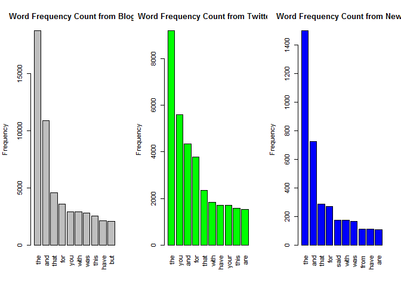
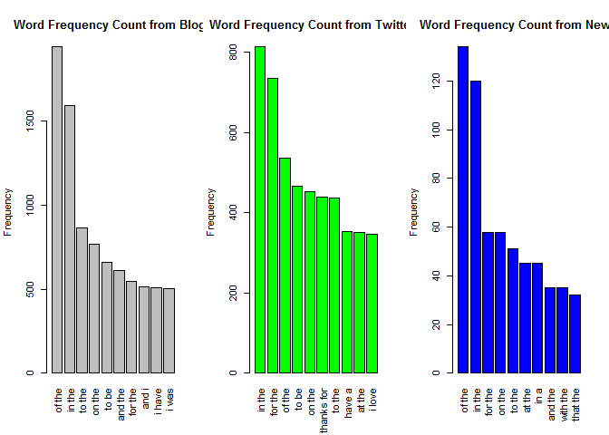
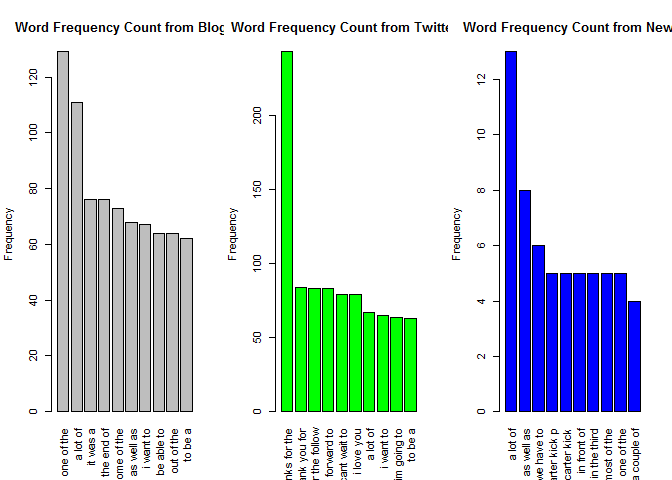

# Data Science Capstone Project Course Report
Chuong Hoang  
Sunday, Mar 20, 2016  

## I. Introduction

The goal of this report is to demonstrate that author have gotten used to working with the data and have been on track to create the prediction algorithm. This document explain only the major features of the data have identified and briefly summarize the plans for creating the prediction algorithm and Shiny app. There are some tables and plots to illustrate important summaries of the data set with the motivation for the report are:

1. Demonstrate that data have been downloaded and loaded successfully.
2. Provide summary about the data sets including Word counts, line counts and other basic info about data tables.
3. Conduct Exploratory Analysis and report feature of the data.
4. Get feedback on the project plans for creating a prediction algorithm and Shiny app.

## II. Getting and Cleanse Data

**Libraries in Used**

Following are libraries that are used in the report


```r
library(tm)      # Text Minning Library    
library(stringr) # Support to basic file summary
library(RWeka)   # Support to n-gram processes
library(stringi)
library(slam)
library(ggplot2)
```

**Getting Data**

Read 3 files into variables


```r
blogsCon <- file("en_US/en_US.blogs.txt", "r")
blogs <- readLines(blogsCon, encoding="UTF-8", skipNul = TRUE)
close(blogsCon)

twitterCon <- file("en_US/en_US.twitter.txt", "r")
twitter <- readLines(twitterCon, encoding="UTF-8", skipNul = TRUE)
close(twitterCon)

newsCon <- file("en_US/en_US.news.txt", "r")
news <- readLines(newsCon, encoding="UTF-8", skipNul = TRUE)
close(newsCon)
```

**Basic Summary**

| Filename | File Size | Line Count | Word Count |
|----------|-----------|------------|------------|
| en_US.blogs.txt | 200.42 | 899288 | 37334131 |
| en_US.twitter.txt | 159.36 | 2360148 | 30373583 |
| en_US.news.txt | 196.28 | 77259 | 2643969 | 


**Cleansing Data**

Dealling with big size datasets we took a random sample of 1% for each data source.


```r
# set seed for reproducible results
set.seed(1243)

blogSample <- sample(blogs, size=round(length(blogs)*0.01)) 
twitSample <- sample(twitter, size=round(length(twitter)*0.01))
newsSample <- sample(news, size=round(length(news)*0.01))

#Release orininal character vector 
rm(list = c("blogs", "news", "twitter", "blogsCon", "newsCon", "twitterCon")) 
```

We will leverage cleansing feature of *tm* package, therefore before operate cleansing process we will need to convert *character vector* objects into *Corpus* objects.


```r
blogCorpus <- Corpus(VectorSource(blogSample), readerControl=list(reader=readPlain, language="en_US", load=TRUE))

twitCorpus <- Corpus(VectorSource(twitSample), readerControl=list(reader = readPlain, language="en_US", load = TRUE))

newsCorpus <- Corpus(VectorSource(newsSample), readerControl=list(reader=readPlain, language="en_US", load=TRUE))

#Release unused objects
rm(list = c("blogSample", "twitSample", "newsSample")) 
```
         
We will apply follow cleansing processes:

* Convert non UTF8 to byte character denoted (that solve some issue with special characters in twitter source)
* Remove Punctuation
* Transform all characters to lowcase
* Strip Whitespace
* Remove Numbers
* Remove Profane Words (source of profane words [link](https://gist.github.com/ryanlewis/a37739d710ccdb4b406d#file-google_twunter_lol) )


```r
#read profane words archived list
profList <- file("./profanewords.txt", "r")
profWords <- readLines(profList, encoding="UTF-8", skipNul = TRUE)
close(profList)

## Cleanse Data Function
cleanData <- function(x){
  x <- tm_map(x,content_transformer(function(x) stri_replace_all_regex(x, "[^\\p{L}\\s[']]+","")))
  x <- tm_map(x, content_transformer(function(x) iconv(enc2utf8(x), sub = "byte")))
  x <- tm_map(x, content_transformer(removePunctuation))
  x <- tm_map(x, content_transformer(tolower))
  x <- tm_map(x, stripWhitespace)
  x <- tm_map(x, removeNumbers)
  #x <- tm_map(x, removeWords, stopwords("english"))
  x <- tm_map(x, removeWords, profWords) # Remove profane words
  x
}

## Cleansing Data
blogCorpus <- cleanData(blogCorpus)
twitCorpus <- cleanData(twitCorpus)
newsCorpus <- cleanData(newsCorpus)
```

## Exploratory Analysis

**Exploratory Preparation**

After cleansing processes now the data are ready to apply further Exploratory Analysis.
leverage RWeka library to create 1-gram, 2-gram, 3-gram tokenizers

```r
## Define Weka_Control parameters
uniGramTokenizer <- function(x) NGramTokenizer(x, Weka_control(min=1, max=1, delimiters= " \\r\\n\\t.,;:\"()?!"))
binGramTokenizer <- function(x) NGramTokenizer(x, Weka_control(min=2, max=2, delimiters= " \\r\\n\\t.,;:\"()?!"))
triGramTokenizer <- function(x) NGramTokenizer(x, Weka_control(min=3, max=3, delimiters= " \\r\\n\\t.,;:\"()?!"))

## Tokenization of Blogs Data
blogUniGramMatrix <- TermDocumentMatrix(blogCorpus, control = list(tokenize = uniGramTokenizer))
blogBinGramMatrix <- TermDocumentMatrix(blogCorpus, control = list(tokenize = binGramTokenizer))
blogTriGramMatrix <- TermDocumentMatrix(blogCorpus, control = list(tokenize = triGramTokenizer))

## Tokenization of Twitter Data
twitUniGramMatrix <- TermDocumentMatrix(twitCorpus, control = list(tokenize = uniGramTokenizer))
twitBinGramMatrix <- TermDocumentMatrix(twitCorpus, control = list(tokenize = binGramTokenizer))
twitTriGramMatrix <- TermDocumentMatrix(twitCorpus, control = list(tokenize = triGramTokenizer))

## Tokenization of News Data
newsUniGramMatrix <- TermDocumentMatrix(newsCorpus, control = list(tokenize = uniGramTokenizer))
newsBinGramMatrix <- TermDocumentMatrix(newsCorpus, control = list(tokenize = binGramTokenizer))
newsTriGramMatrix <- TermDocumentMatrix(newsCorpus, control = list(tokenize = triGramTokenizer))
```

**Explore the Most Frequently unigrams in sample data sets**


```r
## Function to return top n in frequence of provided ngram
topNGram <- function(tdm, n){
  rollupMatrix <- as.matrix(rollup(tdm, MARGIN=2L, FUN=sum)) 
  ## MARGIN = 2L indicate the rollup will apply by row base on dimnames are our ngram elements
  top_n_gram <- sort(rowSums(rollupMatrix), decreasing=TRUE)[1:n]
  top_n_gram
}

topBlogUniGram <- topNGram(blogUniGramMatrix, 10)
topTwitUniGram <- topNGram(twitUniGramMatrix, 10)
topNewsUniGram <- topNGram(newsUniGramMatrix, 10)

par(mfrow=c(1,3), las = 3)
barplot(topBlogUniGram, names.arg=names(topBlogUniGram), main="Word Frequency Count from Blogs", ylab="Frequency", col="grey")
barplot(topTwitUniGram, names.arg=names(topTwitUniGram), main="Word Frequency Count from Twitters",  ylab="Frequency", col="green")
barplot(topNewsUniGram, names.arg=names(topNewsUniGram), main="Word Frequency Count from News", ylab="Frequency", col="blue")
```

\

**Explore the Most Frequently bingram in sample data sets**


```r
# Return top BinGram of each data set
topBlogBinGram <- topNGram(blogBinGramMatrix, 10)
topTwitBinGram <- topNGram(twitBinGramMatrix, 10)
topNewsBinGram <- topNGram(newsBinGramMatrix, 10)

par(mfrow=c(1,3), las = 3)
barplot(topBlogBinGram, names.arg=names(topBlogBinGram), main="Word Frequency Count from Blogs", ylab="Frequency", col="grey") 
barplot(topTwitBinGram, names.arg=names(topTwitBinGram), main="Word Frequency Count from Twitters", ylab="Frequency", col="green")
barplot(topNewsBinGram, names.arg=names(topNewsBinGram), main="Word Frequency Count from News", ylab="Frequency", col="blue")
```

\

**Explore the Most Frequently trigram in sample data sets**


```r
## Aggregate ngram in table form

topBlogTriGram <- topNGram(blogTriGramMatrix, 10)
topTwitTriGram <- topNGram(twitTriGramMatrix, 10)
topNewsTriGram <- topNGram(newsTriGramMatrix, 10)

par(mfrow=c(1,3), las = 3)
barplot(topBlogTriGram, names.arg=names(topBlogTriGram), main="Word Frequency Count from Blogs", ylab="Frequency", col="grey")
barplot(topTwitTriGram, names.arg=names(topTwitTriGram), main="Word Frequency Count from Twitters", ylab="Frequency", col="green")
barplot(topNewsTriGram, names.arg=names(topNewsTriGram), main="Word Frequency Count from News", ylab="Frequency", col="blue")
```

\


## The Project Plan

Following are some step that we will need to conduct to complete the Project:

1. Build a predictive model based on the n-gram model provided in this report.
2. Evaluate the model for efficiency and accuracy. Evaluate the model accuracy using different metrics like perplexity, accuracy at the first word, second word, and third word.
3. Explore new models and data to improve predictive model.
4. Create a data product to show off the prediction algorithm. That will need a Shiny app  accepts an n-gram and predicts the next word.
5. Create a slide deck promoting the product. within 5 slides (using RStudio Presenter) explaining the product
